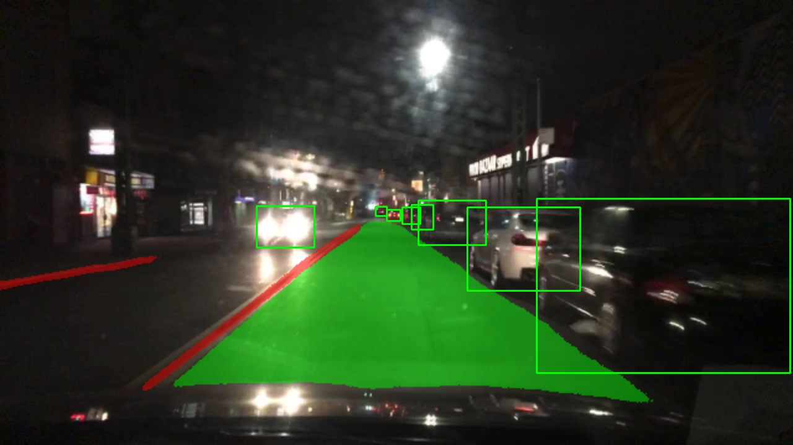
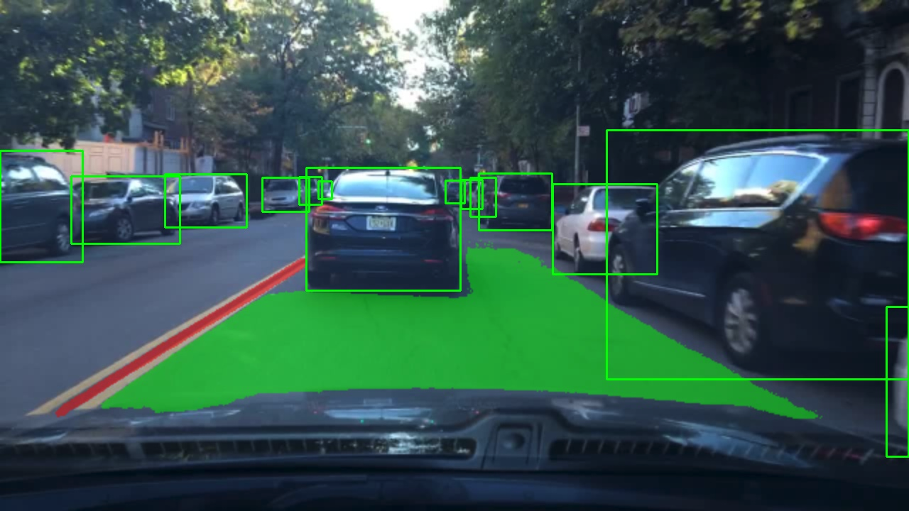
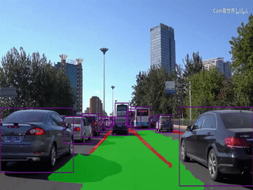
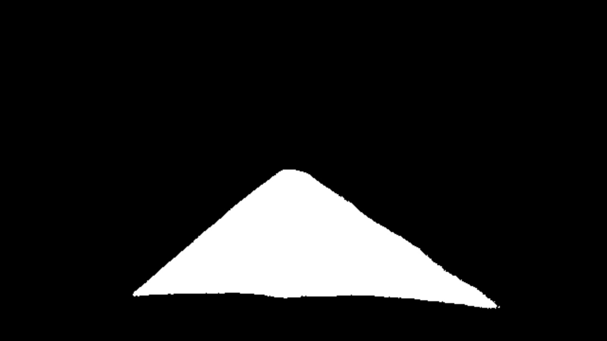
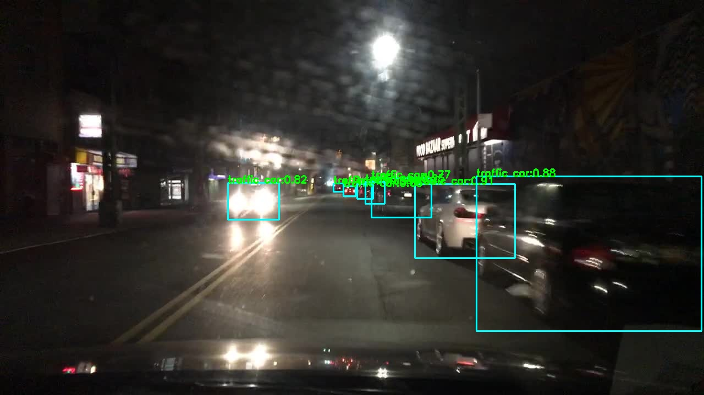
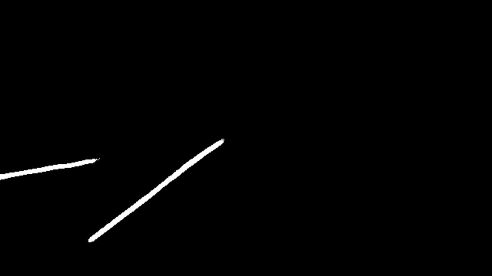
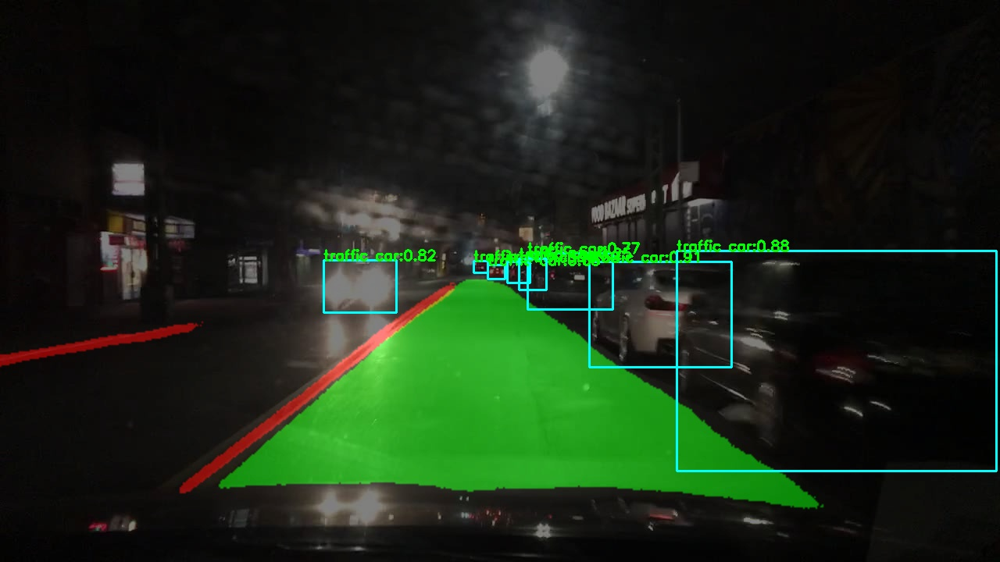

# yolop-ncnn-mnn-tnn-onnxruntime
使用Lite.AI.ToolKit 🚀🚀🌟 C++工具箱来跑YOLOP的一些案例(https://github.com/DefTruth/lite.ai.toolkit) , 包含ONNXRuntime C++、MNN、NCNN和TNN版本。

<div align='center'>
  
  
  
  

</div>   

若是有用，❤️不妨给个⭐️🌟支持一下吧~ 🙃🤪🍀

## 2. C++版本源码

YOLOP C++ 版本的源码包含ONNXRuntime、MNN、NCNN和TNN四个版本，可以在 [lite.ai.toolkit](https://github.com/DefTruth/lite.ai.toolkit) 工具箱中找到。本项目主要介绍如何基于 [lite.ai.toolkit](https://github.com/DefTruth/lite.ai.toolkit) 工具箱，直接使用YOLOP来跑全景分割和检测。需要说明的是，本项目是基于MacOS下编译的 [liblite.ai.toolkit.v0.1.0.dylib](https://github.com/DefTruth/yolop.lite.ai.toolkit/blob/main/lite.ai.toolkit/lib) 来实现的，对于使用MacOS的用户，可以直接下载本项目包含的*liblite.ai.toolkit.v0.1.0*动态库和其他依赖库进行使用。而非MacOS用户，则需要从[lite.ai.toolkit](https://github.com/DefTruth/lite.ai.toolkit) 中下载源码进行编译。[lite.ai.toolkit](https://github.com/DefTruth/lite.ai.toolkit) c++工具箱目前包含70+流行的开源模型。
* [yolop.cpp](https://github.com/DefTruth/lite.ai.toolkit/blob/main/lite/ort/cv/yolop.cpp)
* [yolop.h](https://github.com/DefTruth/lite.ai.toolkit/blob/main/lite/ort/cv/yolop.h)
* [mnn_yolop.cpp](https://github.com/DefTruth/lite.ai.toolkit/blob/main/lite/mnn/cv/mnn_yolop.cpp)
* [mnn_yolop.h](https://github.com/DefTruth/lite.ai.toolkit/blob/main/lite/mnn/cv/mnn_yolop.h)
* [tnn_yolop.cpp](https://github.com/DefTruth/lite.ai.toolkit/blob/main/lite/tnn/cv/tnn_yolop.cpp)
* [tnn_yolop.h](https://github.com/DefTruth/lite.ai.toolkit/blob/main/lite/tnn/cv/tnn_yolop.h)
* [ncnn_yolop.cpp](https://github.com/DefTruth/lite.ai.toolkit/blob/main/lite/ncnn/cv/ncnn_yolop.cpp)
* [ncnn_yolop.h](https://github.com/DefTruth/lite.ai.toolkit/blob/main/lite/ncnn/cv/ncnn_yolop.h)

ONNXRuntime C++、MNN、NCNN和TNN版本的推理实现均已测试通过，欢迎白嫖~  


## 3. 模型文件

### 3.1 ONNX模型文件
可以从我提供的链接下载 ([Baidu Drive](https://pan.baidu.com/s/1elUGcx7CZkkjEoYhTMwTRQ) code: 8gin)。


|                 Class                 |      Pretrained ONNX Files      |              Rename or Converted From (Repo)              | Size  |
| :-----------------------------------: | :-----------------------------: | :-------------------------------------------------------: | :---: |  
| *lite::cv::detection::YOLOP* |    yolop-1280-1280.onnx     |       [YOLOP](https://github.com/hustvl/YOLOP)       | 30Mb  |
| *lite::cv::detection::YOLOP* |    yolop-640-640.onnx     |       [YOLOP](https://github.com/hustvl/YOLOP)       | 30Mb  |
| *lite::cv::detection::YOLOP* |    yolop-320-320.onnx     |       [YOLOP](https://github.com/hustvl/YOLOP)       | 30Mb  |


### 3.2 MNN模型文件
MNN模型文件下载地址，([Baidu Drive](https://pan.baidu.com/s/1KyO-bCYUv6qPq2M8BH_Okg) code: 9v63)。

|                 Class                 |      Pretrained MNN Files      |              Rename or Converted From (Repo)              | Size  |
| :-----------------------------------: | :-----------------------------: | :-------------------------------------------------------: | :---: |
|     *lite::mnn::cv::detection::YOLOP*      |       yolop-320-320.mnn           |  [YOLOP](https://github.com/hustvl/YOLOP)   | 30Mb  |
|     *lite::mnn::cv::detection::YOLOP*      |       yolop-640-640.mnn         |  [YOLOP](https://github.com/hustvl/YOLOP)   | 30Mb  |
|     *lite::mnn::cv::detection::YOLOP*      |       yolop-1280-1280.mnn         |  [YOLOP](https://github.com/hustvl/YOLOP)   | 30Mb |


### 3.3 TNN模型文件
TNN模型文件下载地址，([Baidu Drive](https://pan.baidu.com/s/1lvM2YKyUbEc5HKVtqITpcw) code: 6o6k)。

|                 Class                 |      Pretrained TNN Files      |              Rename or Converted From (Repo)              | Size  |
| :-----------------------------------: | :-----------------------------: | :-------------------------------------------------------: | :---: |
|     *lite::tnn::cv::detection::YOLOP*      |          yolop-320-320.opt.tnnproto&tnnmodel           |  [YOLOP](https://github.com/hustvl/YOLOP)   | 30Mb |
|     *lite::tnn::cv::detection::YOLOP*      |          yolop-640-640.opt.tnnproto&tnnmodel           |  [YOLOP](https://github.com/hustvl/YOLOP)   | 30Mb |
|     *lite::tnn::cv::detection::YOLOP*      |          yolop-1280-1280.opt.tnnproto&tnnmodel           |  [YOLOP](https://github.com/hustvl/YOLOP)   | 30Mb  |


### 3.4 NCNN模型文件
TNN模型文件下载地址，([Baidu Drive](https://pan.baidu.com/s/1hlnqyNsFbMseGFWscgVhgQ) code: sc7f)。

|                 Class                 |      Pretrained NCNN Files      |              Rename or Converted From (Repo)              | Size  |
| :-----------------------------------: | :-----------------------------: | :-------------------------------------------------------: | :---: |
|     *lite::ncnn::cv::detection::YOLOP*      |          yolop-640-640.opt.param&bin           |  [YOLOP](https://github.com/hustvl/YOLOP)   | 30Mb |


## 4. 接口文档

在[lite.ai.toolkit](https://github.com/DefTruth/lite.ai.toolkit) 中，YOLOP的实现类为：

```c++
class LITE_EXPORTS lite::cv::detection::YOLOP;
class LITE_EXPORTS lite::mnn::cv::detection::YOLOP;
class LITE_EXPORTS lite::tnn::cv::detection::YOLOP;
class LITE_EXPORTS lite::ncnn::cv::detection::YOLOP;
```  

该类型目前包含1公共接口`detect`用于进行目标检测。
```c++
public:
    void detect(const cv::Mat &mat,
                std::vector<types::Boxf> &detected_boxes,
                types::SegmentContent &da_seg_content,
                types::SegmentContent &ll_seg_content,
                float score_threshold = 0.25f, float iou_threshold = 0.45f,
                unsigned int topk = 100, unsigned int nms_type = NMS::OFFSET);
```
`detect`接口的输入参数说明：
* mat: cv::Mat类型，BGR格式。
* detected_boxes: Boxf向量，包含被检测到的车辆框，Boxf中包含x1,y1,x2,y2,label,score等成员
* da_seg_content: SegmentContent用来保存预测的可驾驶区域结果
* ll_seg_content: SegmentContent用来保存预测的航道区域结果  
* score_threshold：分类得分（质量得分）阈值，默认0.45，小于该阈值的框将被丢弃。
* iou_threshold：NMS中的iou阈值，默认0.3。
* topk：默认100，只保留前k个检测到的结果。
* nms_type：NMS算法的类型，默认为不同的类别各自做NMS。


## 5. 使用案例

### 5.1 ONNXRuntime版本
```c++
#include "lite/lite.h"

static void test_default()
{
    std::string onnx_path = "..//hub/onnx/cv/yolop-640-640.onnx";
    std::string test_img_path = "../resources/1.jpg";
    std::string save_det_path = "../logs/1_det.jpg";
    std::string save_da_path = "../logs/1_da.jpg";
    std::string save_ll_path = "../logs/1_ll.jpg";
    std::string save_merge_path = "../logs/1_merge.jpg";
    
    auto *yolop = new lite::cv::detection::YOLOP(onnx_path, 16); // 16 threads
    
    lite::types::SegmentContent da_seg_content;
    lite::types::SegmentContent ll_seg_content;
    std::vector<lite::types::Boxf> detected_boxes;
    cv::Mat img_bgr = cv::imread(test_img_path);
    yolop->detect(img_bgr, detected_boxes, da_seg_content, ll_seg_content);
    
    if (!detected_boxes.empty() && da_seg_content.flag && ll_seg_content.flag)
    {
        // boxes.
        cv::Mat img_det = img_bgr.clone();
        lite::utils::draw_boxes_inplace(img_det, detected_boxes);
        cv::imwrite(save_det_path, img_det);
        std::cout << "Saved " << save_det_path << " done!" << "\n";
        // da && ll seg
        cv::imwrite(save_da_path, da_seg_content.class_mat);
        cv::imwrite(save_ll_path, ll_seg_content.class_mat);
        std::cout << "Saved " << save_da_path << " done!" << "\n";
        std::cout << "Saved " << save_ll_path << " done!" << "\n";
        // merge
        cv::Mat img_merge = img_bgr.clone();
        cv::Mat color_seg = da_seg_content.color_mat + ll_seg_content.color_mat;
        
        cv::addWeighted(img_merge, 0.5, color_seg, 0.5, 0., img_merge);
        lite::utils::draw_boxes_inplace(img_merge, detected_boxes);
        cv::imwrite(save_merge_path, img_merge);
        std::cout << "Saved " << save_merge_path << " done!" << "\n";
        
        // label
        if (!da_seg_content.names_map.empty() && !ll_seg_content.names_map.empty())
        {
        
            for (auto it = da_seg_content.names_map.begin(); it != da_seg_content.names_map.end(); ++it)
            {
                std::cout << "Default Version Detected Label: "
                << it->first << " Name: " << it->second << std::endl;
            }
            
            for (auto it = ll_seg_content.names_map.begin(); it != ll_seg_content.names_map.end(); ++it)
            {
                std::cout << "Default Version Detected Label: "
                << it->first << " Name: " << it->second << std::endl;
            }
            
        }
    }
    
    delete yolop;
}

```  

### 5.2 MNN版本
```c++
#include "lite/lite.h"

static void test_mnn()
{
#ifdef ENABLE_MNN
    std::string mnn_path = "../hub/mnn/cv/yolop-640-640.mnn";
    std::string test_img_path = "../resources/1.jpg";
    std::string save_det_path = "../logs/1_det_mnn.jpg";
    std::string save_da_path = "../logs/1_da_mnn.jpg";
    std::string save_ll_path = "../logs/1_ll_mnn.jpg";
    std::string save_merge_path = "../logs/1_merge_mnn.jpg";
    
    auto *yolop = new lite::mnn::cv::detection::YOLOP(mnn_path, 16); // 16 threads
    
    lite::types::SegmentContent da_seg_content;
    lite::types::SegmentContent ll_seg_content;
    std::vector<lite::types::Boxf> detected_boxes;
    cv::Mat img_bgr = cv::imread(test_img_path);
    yolop->detect(img_bgr, detected_boxes, da_seg_content, ll_seg_content);
    
    if (!detected_boxes.empty() && da_seg_content.flag && ll_seg_content.flag)
    {
        // boxes.
        cv::Mat img_det = img_bgr.clone();
        lite::utils::draw_boxes_inplace(img_det, detected_boxes);
        cv::imwrite(save_det_path, img_det);
        std::cout << "Saved " << save_det_path << " done!" << "\n";
        // da && ll seg
        cv::imwrite(save_da_path, da_seg_content.class_mat);
        cv::imwrite(save_ll_path, ll_seg_content.class_mat);
        std::cout << "Saved " << save_da_path << " done!" << "\n";
        std::cout << "Saved " << save_ll_path << " done!" << "\n";
        // merge
        cv::Mat img_merge = img_bgr.clone();
        cv::Mat color_seg = da_seg_content.color_mat + ll_seg_content.color_mat;
        
        cv::addWeighted(img_merge, 0.5, color_seg, 0.5, 0., img_merge);
        lite::utils::draw_boxes_inplace(img_merge, detected_boxes);
        cv::imwrite(save_merge_path, img_merge);
        std::cout << "Saved " << save_merge_path << " done!" << "\n";
        
        // label
        if (!da_seg_content.names_map.empty() && !ll_seg_content.names_map.empty())
        {
        
            for (auto it = da_seg_content.names_map.begin(); it != da_seg_content.names_map.end(); ++it)
            {
                std::cout << "MNN Version Detected Label: "
                << it->first << " Name: " << it->second << std::endl;
            }
            
            for (auto it = ll_seg_content.names_map.begin(); it != ll_seg_content.names_map.end(); ++it)
            {
                std::cout << "MNN Version Detected Label: "
                << it->first << " Name: " << it->second << std::endl;
            }
        
        }
    }
    
    delete yolop;
#endif
}
```  

### 5.3 TNN版本
```c++
#include "lite/lite.h"

static void test_tnn()
{
#ifdef ENABLE_TNN
    std::string proto_path = "../hub/tnn/cv/yolop-640-640.opt.tnnproto";
    std::string model_path = "../hub/tnn/cv/yolop-640-640.opt.tnnmodel";
    std::string test_img_path = "../resources/1.jpg";
    std::string save_det_path = "../logs/1_det_tnn.jpg";
    std::string save_da_path = "../logs/1_da_tnn.jpg";
    std::string save_ll_path = "../logs/1_ll_tnn.jpg";
    std::string save_merge_path = "../logs/1_merge_tnn.jpg";
    
    auto *yolop = new lite::tnn::cv::detection::YOLOP(proto_path, model_path, 16); // 16 threads
    
    lite::types::SegmentContent da_seg_content;
    lite::types::SegmentContent ll_seg_content;
    std::vector<lite::types::Boxf> detected_boxes;
    cv::Mat img_bgr = cv::imread(test_img_path);
    yolop->detect(img_bgr, detected_boxes, da_seg_content, ll_seg_content);
    
    if (!detected_boxes.empty() && da_seg_content.flag && ll_seg_content.flag)
    {
        // boxes.
        cv::Mat img_det = img_bgr.clone();
        lite::utils::draw_boxes_inplace(img_det, detected_boxes);
        cv::imwrite(save_det_path, img_det);
        std::cout << "Saved " << save_det_path << " done!" << "\n";
        // da && ll seg
        cv::imwrite(save_da_path, da_seg_content.class_mat);
        cv::imwrite(save_ll_path, ll_seg_content.class_mat);
        std::cout << "Saved " << save_da_path << " done!" << "\n";
        std::cout << "Saved " << save_ll_path << " done!" << "\n";
        // merge
        cv::Mat img_merge = img_bgr.clone();
        cv::Mat color_seg = da_seg_content.color_mat + ll_seg_content.color_mat;
        
        cv::addWeighted(img_merge, 0.5, color_seg, 0.5, 0., img_merge);
        lite::utils::draw_boxes_inplace(img_merge, detected_boxes);
        cv::imwrite(save_merge_path, img_merge);
        std::cout << "Saved " << save_merge_path << " done!" << "\n";
        
        // label
        if (!da_seg_content.names_map.empty() && !ll_seg_content.names_map.empty())
        {
        
            for (auto it = da_seg_content.names_map.begin(); it != da_seg_content.names_map.end(); ++it)
            {
                std::cout << "TNN Version Detected Label: "
                << it->first << " Name: " << it->second << std::endl;
            }
        
            for (auto it = ll_seg_content.names_map.begin(); it != ll_seg_content.names_map.end(); ++it)
            {
                std::cout << "TNN Version Detected Label: "
                << it->first << " Name: " << it->second << std::endl;
            }
        
        }
    }
    
    delete yolop;
#endif
}
```  

### 5.4 NCNN版本
```c++
#include "lite/lite.h"

static void test_ncnn()
{
#ifdef ENABLE_NCNN
    std::string param_path = "../hub/ncnn/cv/yolop-640-640.opt.param";
    std::string bin_path = "../hub/ncnn/cv/yolop-640-640.opt.bin";
    std::string test_img_path = "../resources/1.jpg";
    std::string save_det_path = "../logs/1_det_ncnn.jpg";
    std::string save_da_path = "../logs/1_da_ncnn.jpg";
    std::string save_ll_path = "../logs/1_ll_ncnn.jpg";
    std::string save_merge_path = "../logs/1_merge_ncnn.jpg";
    
    auto *yolop = new lite::ncnn::cv::detection::YOLOP(param_path, bin_path, 16); // 16 threads
    
    lite::types::SegmentContent da_seg_content;
    lite::types::SegmentContent ll_seg_content;
    std::vector<lite::types::Boxf> detected_boxes;
    cv::Mat img_bgr = cv::imread(test_img_path);
    yolop->detect(img_bgr, detected_boxes, da_seg_content, ll_seg_content);
    
    if (!detected_boxes.empty() && da_seg_content.flag && ll_seg_content.flag)
    {
        // boxes.
        cv::Mat img_det = img_bgr.clone();
        lite::utils::draw_boxes_inplace(img_det, detected_boxes);
        cv::imwrite(save_det_path, img_det);
        std::cout << "Saved " << save_det_path << " done!" << "\n";
        // da && ll seg
        cv::imwrite(save_da_path, da_seg_content.class_mat);
        cv::imwrite(save_ll_path, ll_seg_content.class_mat);
        std::cout << "Saved " << save_da_path << " done!" << "\n";
        std::cout << "Saved " << save_ll_path << " done!" << "\n";
        // merge
        cv::Mat img_merge = img_bgr.clone();
        cv::Mat color_seg = da_seg_content.color_mat + ll_seg_content.color_mat;
        
        cv::addWeighted(img_merge, 0.5, color_seg, 0.5, 0., img_merge);
        lite::utils::draw_boxes_inplace(img_merge, detected_boxes);
        cv::imwrite(save_merge_path, img_merge);
        std::cout << "Saved " << save_merge_path << " done!" << "\n";
        
        // label
        if (!da_seg_content.names_map.empty() && !ll_seg_content.names_map.empty())
        {
        
            for (auto it = da_seg_content.names_map.begin(); it != da_seg_content.names_map.end(); ++it)
            {
                std::cout << "NCNN Version Detected Label: "
                << it->first << " Name: " << it->second << std::endl;
            }
        
            for (auto it = ll_seg_content.names_map.begin(); it != ll_seg_content.names_map.end(); ++it)
            {
                std::cout << "NCNN Version Detected Label: "
                << it->first << " Name: " << it->second << std::endl;
            }
        
        }
    }
    
    delete yolop;
#endif
}
```  

* 输出结果为:  

<div align='center'>
  
  
  
  

</div>   


## 6. 编译运行
在MacOS下可以直接编译运行本项目，无需下载其他依赖库。其他系统则需要从[lite.ai.toolkit](https://github.com/DefTruth/lite.ai.toolkit) 中下载源码先编译*lite.ai.toolkit.v0.1.0*动态库。
```shell
git clone --depth=1 https://github.com/DefTruth/yolop.lite.ai.toolkit.git
cd yolop.lite.ai.toolkit 
sh ./build.sh
```  

* CMakeLists.txt设置

```cmake
cmake_minimum_required(VERSION 3.17)
project(yolop.lite.ai.toolkit)

set(CMAKE_CXX_STANDARD 11)

# setting up lite.ai.toolkit
set(LITE_AI_DIR ${CMAKE_SOURCE_DIR}/lite.ai.toolkit)
set(LITE_AI_INCLUDE_DIR ${LITE_AI_DIR}/include)
set(LITE_AI_LIBRARY_DIR ${LITE_AI_DIR}/lib)
include_directories(${LITE_AI_INCLUDE_DIR})
link_directories(${LITE_AI_LIBRARY_DIR})

set(OpenCV_LIBS
        opencv_highgui
        opencv_core
        opencv_imgcodecs
        opencv_imgproc
        opencv_video
        opencv_videoio
        )
# add your executable
set(EXECUTABLE_OUTPUT_PATH ${CMAKE_SOURCE_DIR}/examples/build)

add_executable(lite_yolop examples/test_lite_yolop.cpp)
target_link_libraries(lite_yolop
        lite.ai.toolkit
        onnxruntime
        MNN  # need, if built lite.ai.toolkit with ENABLE_MNN=ON,  default OFF
        ncnn # need, if built lite.ai.toolkit with ENABLE_NCNN=ON, default OFF
        TNN  # need, if built lite.ai.toolkit with ENABLE_TNN=ON,  default OFF
        ${OpenCV_LIBS})  # link lite.ai.toolkit & other libs.
```

* building && testing information:
```shell
[ 50%] Building CXX object CMakeFiles/lite_yolop.dir/examples/test_lite_yolop.cpp.o
[100%] Linking CXX executable lite_yolop
[100%] Built target lite_yolop
Testing Start ...
LITEORT_DEBUG LogId: ..//hub/onnx/cv/yolop-640-640.onnx
=============== Input-Dims ==============
input_node_dims: 1
input_node_dims: 3
input_node_dims: 640
input_node_dims: 640
=============== Output-Dims ==============
Output: 0 Name: det_out Dim: 0 :1
Output: 0 Name: det_out Dim: 1 :25200
Output: 0 Name: det_out Dim: 2 :6
Output: 1 Name: drive_area_seg Dim: 0 :1
Output: 1 Name: drive_area_seg Dim: 1 :2
Output: 1 Name: drive_area_seg Dim: 2 :640
Output: 1 Name: drive_area_seg Dim: 3 :640
Output: 2 Name: lane_line_seg Dim: 0 :1
Output: 2 Name: lane_line_seg Dim: 1 :2
Output: 2 Name: lane_line_seg Dim: 2 :640
Output: 2 Name: lane_line_seg Dim: 3 :640
========================================
detected num_anchors: 25200
generate_bboxes num: 62
Saved ../logs/1_det.jpg done!
Saved ../logs/1_da.jpg done!
Saved ../logs/1_ll.jpg done!
Saved ../logs/1_merge.jpg done!
Default Version Detected Label: 255 Name: drivable area
Default Version Detected Label: 255 Name: lane line
LITEORT_DEBUG LogId: ..//hub/onnx/cv/yolop-640-640.onnx
=============== Input-Dims ==============
input_node_dims: 1
input_node_dims: 3
input_node_dims: 640
input_node_dims: 640
=============== Output-Dims ==============
Output: 0 Name: det_out Dim: 0 :1
Output: 0 Name: det_out Dim: 1 :25200
Output: 0 Name: det_out Dim: 2 :6
Output: 1 Name: drive_area_seg Dim: 0 :1
Output: 1 Name: drive_area_seg Dim: 1 :2
Output: 1 Name: drive_area_seg Dim: 2 :640
Output: 1 Name: drive_area_seg Dim: 3 :640
Output: 2 Name: lane_line_seg Dim: 0 :1
Output: 2 Name: lane_line_seg Dim: 1 :2
Output: 2 Name: lane_line_seg Dim: 2 :640
Output: 2 Name: lane_line_seg Dim: 3 :640
========================================
detected num_anchors: 25200
generate_bboxes num: 62
Saved ../logs/1_det_onnx.jpg done!
Saved ../logs/1_da_onnx.jpg done!
Saved ../logs/1_ll_onnx.jpg done!
Saved ../logs/1_merge_onnx.jpg done!
ONNXRuntime Version Detected Label: 255 Name: drivable area
ONNXRuntime Version Detected Label: 255 Name: lane line
LITEMNN_DEBUG LogId: ../hub/mnn/cv/yolop-640-640.mnn
=============== Input-Dims ==============
        **Tensor shape**: 1, 3, 640, 640, 
Dimension Type: (CAFFE/PyTorch/ONNX)NCHW
=============== Output-Dims ==============
getSessionOutputAll done!
Output: det_out:        **Tensor shape**: 1, 25200, 6, 
Output: drive_area_seg:         **Tensor shape**: 1, 2, 640, 640, 
Output: lane_line_seg:  **Tensor shape**: 1, 2, 640, 640, 
========================================
detected num_anchors: 25200
generate_bboxes num: 62
Saved ../logs/1_det_mnn.jpg done!
Saved ../logs/1_da_mnn.jpg done!
Saved ../logs/1_ll_mnn.jpg done!
Saved ../logs/1_merge_mnn.jpg done!
MNN Version Detected Label: 255 Name: drivable area
MNN Version Detected Label: 255 Name: lane line
LITENCNN_DEBUG LogId: ../hub/ncnn/cv/yolop-640-640.opt.param
=============== Input-Dims ==============
Input: images: shape: c=0 h=0 w=0
=============== Output-Dims ==============
Output: det_stride_8: shape: c=0 h=0 w=0
Output: det_stride_16: shape: c=0 h=0 w=0
Output: det_stride_32: shape: c=0 h=0 w=0
Output: drive_area_seg: shape: c=0 h=0 w=0
Output: lane_line_seg: shape: c=0 h=0 w=0
========================================
generate_bboxes num: 62
Saved ../logs/1_det_ncnn.jpg done!
Saved ../logs/1_da_ncnn.jpg done!
Saved ../logs/1_ll_ncnn.jpg done!
Saved ../logs/1_merge_ncnn.jpg done!
NCNN Version Detected Label: 255 Name: drivable area
NCNN Version Detected Label: 255 Name: lane line
LITETNN_DEBUG LogId: ../hub/tnn/cv/yolop-640-640.opt.tnnproto
=============== Input-Dims ==============
images: [1 3 640 640 ]
Input Data Format: NCHW
=============== Output-Dims ==============
det_out: [1 25200 6 ]
drive_area_seg: [1 2 640 640 ]
lane_line_seg: [1 2 640 640 ]
========================================
detected num_anchors: 25200
generate_bboxes num: 62
Saved ../logs/1_det_tnn.jpg done!
Saved ../logs/1_da_tnn.jpg done!
Saved ../logs/1_ll_tnn.jpg done!
Saved ../logs/1_merge_tnn.jpg done!
TNN Version Detected Label: 255 Name: drivable area
TNN Version Detected Label: 255 Name: lane line
Testing Successful !

```  

<div align='center'>
  
  
  
  

</div>   
